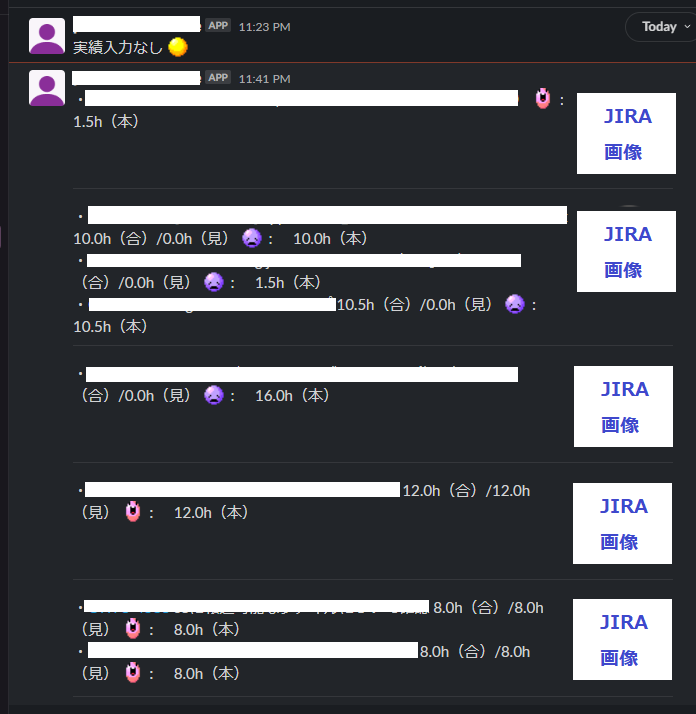

# 概要

対象日のJIRA作業ログを個人別に集計し、Slackに通知するスクリプト 
予実を見える化し、計画に対しての実績を意識することを目的とする 

※python:3.11.3で動作確認済み

# 手順

- Slack Botトークンを取得する
- 通知用のチャンネルを作成する（オプション）
- [JIRA APIトークン](https://support.atlassian.com/ja/atlassian-account/docs/manage-api-tokens-for-your-atlassian-account/)を取得する
- スクリプトの**各種定数**に値を追加する
- `get_condition_icon`関数用の絵文字を登録する
- requirements.txtをインストールする
- スクリプトを実行
- 必要に応じてcronに設定する

# サンプル

